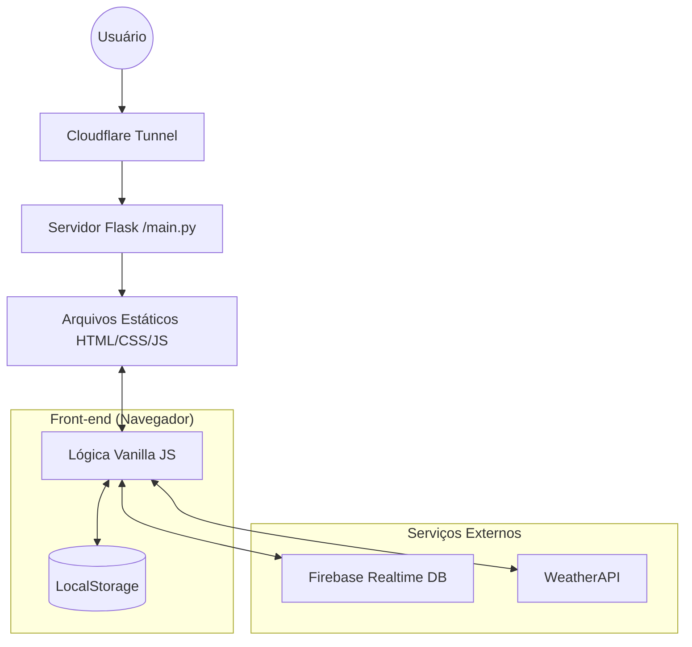

# 🏗️ Design de Sistema: Projeto Suite

Este documento detalha o design de sistema do projeto "Suite", adaptando os padrões de arquitetura para a realidade de um dashboard pessoal de alta performance e resiliência.

## 1. Requisitos do Sistema

### Funcionais
- **Dashboard Unificado**: Centralização de widgets (Clima, Liturgia, Links).
- **Sincronização em Tempo Real**: Atualização de orações entre dispositivos via Firebase.
- **Visualizador de Arquivos**: Navegação em árvore de assets e skills (Database Viewer).
- **Modo Offline**: Funcionamento básico sem internet usando LocalStorage.

### Não Funcionais
- **Performance**: Tempo de carregamento inicial < 1s (uso de Vanilla JS).
- **Disponibilidade**: 99.9% via Cloudflare Tunnel e Modo de Manutenção.
- **Segurança**: Proteção contra ataques DoS (Rate Limiting) e XSS (Sanitização).
- **PWA-Ready**: Sistema de atualização silenciosa para dispositivos móveis.

## 2. Arquitetura de Alto Nível

## 3. Detalhes dos Componentes

### Camada de Servidor (Back-end)
- **Tecnologia**: Python Flask.
- **Responsabilidades**: Roteamento de arquivos, Rate Limiting no servidor, Logs diários.
- **Escalabilidade**: Vertical (máquina única com Cloudflare).

### Camada de Dados (Persistência)
- **Primária (Nuvem)**: Firebase Realtime Database (Sincronização de orações).
- **Local (Cache)**: LocalStorage (Configurações de tema, cache de clima, estado offline).
- **Arquivos**: JSON Estático (`file_structure.json`, `calendario.json`).

### Serviços Externos
- **Autenticação**: Firebase Auth.
- **Clima**: WeatherAPI (Previsão e condições atuais).
- **DNS/Proxy**: Cloudflare (Segurança e Tunelamento).

## 4. Decisões de Design (Rationale)

| Decisão | Motivação |
|----------|-----------|
| **Vanilla JS sobre React** | Performance máxima e ausência de build complexo. |
| **Flask como Static Server** | Simplicidade e facilidade de implementar Rate Limiting em Python. |
| **Firebase para Sincronização** | Baixa latência e plano gratuito generoso para uso pessoal. |
| **LocalStorage para Cache** | Garantia de funcionamento "Offline-First". |

## 5. Estratégia de Segurança
- **TLS 1.3**: Todo tráfego via Cloudflare.
- **Rate Limiting Duplo**: No cliente (JS) e no servidor (Python).
- **Sanitização de DOM**: Uso de `textContent` e funções de escape para prevenir XSS.
- **Headers de Segurança**: Configuração de CSP e X-Frame-Options no servidor.

## 6. Modos de Falha e Mitigação

| Falha | Impacto | Mitigação |
|---------|--------|------------|
| Internet Caída | Perda de Clima/Firebase | Uso de dados cacheados no LocalStorage. |
| Servidor Down | Site Inacessível | Cloudflare exibe página de erro; Modo de Manutenção manual. |
| API de Clima Fora | Widget vazio | Exibição de banner "Offline" e última temperatura salva. |

---
*Baseado no modelo de System Design do projeto, adaptado para a arquitetura Suite.*
